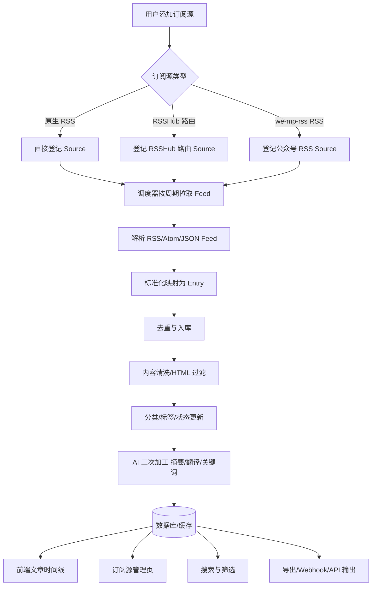
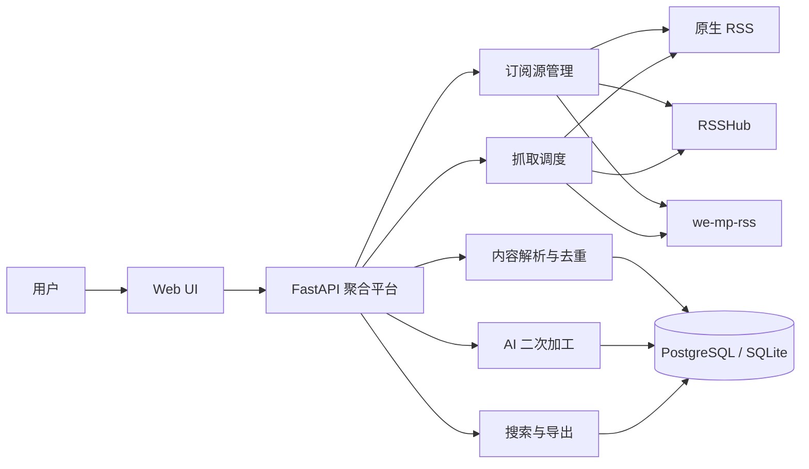

# PRD：私有化信息订阅与智能加工平台

## 1. 文档信息

**文档版本**：V1.0  
**阶段**：MVP / 架构设计输入稿  
**文档目标**：用于与其他 Agent / 架构设计者对齐业务背景、产品目标、能力边界和核心流程，为后续系统架构设计提供统一输入。

---

## 2. 项目背景

### 2.1 问题背景

当前主流信息获取方式高度依赖平台分发与算法推荐，带来几个长期问题：

- 信息源分散，公众号、博客、新闻站点、播客、社交平台内容分布在不同系统中
    
- 用户对内容接入链路缺乏控制，往往依赖第三方聚合服务
    
- 很多高价值内容源不天然提供标准 RSS，需要借助转换工具
    
- 内容获取之后缺少统一的清洗、分类、检索和 AI 二次加工能力
    
- 现成聚合产品通常更偏“消费端”，不一定适合私有化沉淀与深度加工
    

从前期调研来看，**RSSHub** 的本质是“通过社区维护的路由规则，动态抓取目标网站/平台内容并生成 RSS/Atom/JSON Feed 的服务引擎”，不是静态 RSS 链接目录。也就是说，它更适合作为一个“通用内容接入层”。

另一方面，**we-mp-rss** 明确提供微信公众号内容抓取、RSS 生成、定时更新、管理界面以及 API / WebHook 能力，更适合作为“公众号专项接入层”。

### 2.2 现有方案的关键限制

像 Folo / Follow 这类产品虽然支持通过 RSS 链接订阅内容，但其刷新逻辑运行在服务端。官方维护者明确说明：**Folo 在服务器端刷新 RSS，订阅地址必须能被公网访问**；局域网地址或本机地址不在当前支持范围内，相关需求已被关闭。

这意味着：

- 如果用户将 `we-mp-rss` 部署在本机或内网
    
- 且不希望暴露到公网
    
- 就无法依赖 Folo 这类云端聚合产品稳定消费这些 RSS 源。
    

因此，若希望实现：

- 自己控制订阅源接入
    
- 支持本机 / 内网部署的 RSS 服务
    
- 在统一平台查看与加工内容
    
- 形成私有化的信息资产沉淀
    

则需要自建一个**私有化的信息订阅与智能加工平台**。

---

## 3. 项目目标

### 3.1 总体目标

建设一个自部署、可扩展、可控的信息聚合平台，统一接入：

- 原生 RSS 内容源
    
- RSSHub 转换后的通用站点内容源
    
- we-mp-rss 提供的微信公众号 RSS 源
    

并在统一平台内完成：

- 订阅管理
    
- 内容拉取与更新
    
- 去重与清洗
    
- 分类与标签
    
- 搜索与浏览
    
- AI 二次加工
    
- 数据沉淀与导出
    

### 3.2 核心价值

该平台不是单纯的 RSS 阅读器，而是一个：

**“内容接入中台 + 私有阅读工作台 + AI 加工与知识沉淀平台”**

其核心价值在于：

- 将“内容获取权”收回到用户自己手里
    
- 将“内容处理链路”从消费型产品中抽离出来
    
- 为后续知识库、自动化工作流、个性化推荐等能力打基础
    

---

## 4. 产品设计理念

## 4.1 私有可控

所有订阅源接入、刷新、处理和存储链路优先由用户自建系统控制，不依赖第三方云端刷新能力。

## 4.2 接入复用优先

不重复造轮子。优先复用成熟开源项目：

- RSSHub：作为通用内容 RSS 化引擎
    
- we-mp-rss：作为公众号专项 RSS 化引擎
    

平台本身聚焦于“统一接入、统一治理、统一展示、统一加工”。

## 4.3 中台化抽象

不同来源的数据在进入平台后，都要被映射为统一的数据模型：

- Source（订阅源）
    
- Entry（内容项）
    
- Job（任务）
    
- Tag / Category（标签与分类）
    

避免后续业务逻辑与某个接入器深度耦合。

## 4.4 先聚合，后智能

MVP 阶段优先保证：

- 接入稳定
    
- 文章可看
    
- 状态可追踪
    

AI 能力作为增值层逐步叠加，而不是一开始就让系统复杂化。

## 4.5 阅读与加工一体化

平台不仅要“看内容”，也要“处理内容”。  
阅读、搜索、摘要、翻译、标签、导出应统一在同一个工作台中完成。

---

## 5. 目标用户

## 5.1 核心用户画像

- 有较强信息管理需求的个人用户
    
- 希望自建阅读 / 聚合系统的技术用户
    
- 需要长期跟踪公众号、博客、新闻和专业站点的内容消费者
    
- 希望把内容沉淀为知识资产、供后续 AI 处理的用户
    

## 5.2 使用动机

- 摆脱算法流
    
- 聚合分散来源
    
- 私有化保存内容
    
- 对高价值内容做结构化加工
    
- 让内容输入系统具备可扩展性
    

---

## 6. 产品范围

## 6.1 本期范围（MVP）

### 输入侧

- 支持添加原生 RSS
    
- 支持添加 RSSHub 路由源
    
- 支持添加 we-mp-rss 输出的 RSS 源
    

### 平台侧

- 订阅源管理
    
- 定时拉取与手动刷新
    
- 文章入库
    
- 去重与状态追踪
    
- 标签 / 分类
    
- 文章列表与详情页
    
- 基础全文搜索
    
- 单篇 AI 摘要
    

### 输出侧

- Markdown / JSON 导出
    
- Webhook / API 输出能力预留
    

## 6.2 暂不纳入本期

- 移动端原生 App
    
- 多租户 SaaS
    
- 完整权限系统
    
- 推荐系统
    
- 向量检索与 RAG
    
- 复杂工作流引擎
    
- 协同编辑
    

---

## 7. 产品形态定义

## 7.1 交付形态

产品建议形态为：

- **后端服务**：FastAPI
    
- **前端界面**：Web UI
    
- **调度与任务模块**
    
- **数据库与缓存**
    
- **外部接入服务适配层**
    

## 7.2 使用形态

用户通过 Web UI：

1. 添加订阅源
    
2. 配置分类与标签
    
3. 查看内容流
    
4. 搜索历史内容
    
5. 对内容执行摘要 / 翻译 / 导出
    
6. 管理异常源与刷新任务
    

---

## 8. 外部开源项目与职责边界

## 8.1 RSSHub

**定位**：通用网站 / 平台内容 RSS 化引擎  
**作用**：

- 将原本不直接提供 RSS 的网站内容转换为标准订阅源
    
- 通过社区维护 route 规则持续扩展站点支持范围
    
- 作为平台的“通用内容接入层”
    

## 8.2 we-mp-rss

**定位**：微信公众号内容专项 RSS 化工具  
**作用**：

- 微信公众号内容抓取与解析
    
- RSS 生成
    
- 定时更新
    
- Web UI 管理
    
- API / WebHook 支持
    

## 8.3 原生 RSS 源

**定位**：直接可订阅的标准 Feed  
**作用**：

- 直接作为平台输入
    
- 无需中间转换
    

## 8.4 自建聚合平台

**定位**：业务中台与用户主工作台  
**作用**：

- 统一管理所有 Source
    
- 拉取并解析 Entry
    
- 统一清洗、去重、分类、检索
    
- 提供阅读与 AI 加工能力
    
- 沉淀私有数据资产
    

---

## 9. 核心业务逻辑

## 9.1 业务抽象

### Source

一个可被轮询 / 拉取的订阅源。

### Entry

从 Source 中解析出来的一条内容记录，通常是一篇文章、一条动态或一条播客项。

### Job

后台执行的任务，如拉取、解析、摘要、导出等。

### Processing

对 Entry 进行清洗、规范化、摘要、翻译、标签提取等二次处理。

---

## 10. 核心业务流程图

---

## 11. 产品功能设计

## 11.1 模块一：订阅源管理

### 功能目标

统一管理所有内容来源。

### 核心能力

- 添加订阅源
    
- 编辑订阅源
    
- 删除 / 禁用订阅源
    
- 测试订阅源可用性
    
- 配置分类 / 标签
    
- 设置刷新频率
    
- 查看最后成功时间 / 最近错误信息
    

### Source 类型

- native_rss
    
- rsshub
    
- we_mp_rss
    

### MVP 成功标准

- 用户可以在 UI 中成功创建 3 类订阅源
    
- 系统能够识别无效链接并给出错误提示
    
- 每个订阅源都可追踪状态
    

---

## 11.2 模块二：内容抓取与调度

### 功能目标

以周期性 / 手动方式拉取订阅源内容。

### 核心能力

- 定时任务拉取
    
- 手动刷新
    
- 拉取失败重试
    
- 超时控制
    
- 更新日志记录
    

### 关键要求

- 任务必须可追踪
    
- 支持源级别错误隔离
    
- 避免单个坏源拖垮整体系统
    

### MVP 成功标准

- 支持分钟级 / 小时级刷新
    
- 可查看每个任务的执行结果
    

---

## 11.3 模块三：内容解析与去重

### 功能目标

将不同来源的 Feed 解析为统一 Entry 模型，并避免重复内容污染系统。

### 核心能力

- 标题、链接、时间、作者、封面、正文标准化
    
- 按链接 / guid / hash 去重
    
- 支持更新同一条内容的元信息
    

### 关键要求

- 不同源的内容结构必须被统一抽象
    
- 同一文章不重复入库
    

---

## 11.4 模块四：内容清洗与结构化

### 功能目标

提升阅读质量，并为后续 AI 加工准备更干净的输入。

### 核心能力

- HTML 清洗
    
- 正文提取
    
- 广告 / 推荐区过滤
    
- 封面图处理
    
- 摘要前文本裁剪
    

### 说明

该部分可与 we-mp-rss 的 HTML 过滤能力形成互补：源侧先过滤，平台侧再统一清洗。

---

## 11.5 模块五：阅读与浏览

### 功能目标

提供可用的基础消费端能力。

### 页面能力

- 时间线列表
    
- 按订阅源查看
    
- 按分类查看
    
- 按标签查看
    
- 已读 / 未读切换
    
- 收藏 / 稍后读
    
- 文章详情页
    

### 交互要求

- 首屏可快速浏览标题和摘要
    
- 点开详情后可查看清洗后的正文
    
- 阅读状态自动记录
    

---

## 11.6 模块六：搜索与筛选

### 功能目标

支持用户快速定位历史内容。

### 核心能力

- 按标题搜索
    
- 按正文全文搜索
    
- 按来源过滤
    
- 按时间过滤
    
- 按标签过滤
    

### MVP 成功标准

- 可完成基础关键词检索
    
- 可在海量订阅中快速定位内容
    

---

## 11.7 模块七：AI 二次加工

### 功能目标

为内容增加结构化价值，而不是仅做原文展示。

### 第一阶段能力

- 单篇摘要
    
- 关键词提取
    
- 文章语言识别
    
- 可选翻译
    

### 后续扩展

- 自动主题归类
    
- 多篇聚合摘要
    
- 趋势主题提炼
    
- 知识库化
    

### 设计原则

AI 加工为增值层，不阻塞内容主链路。

---

## 11.8 模块八：导出与对外接口

### 功能目标

把平台内容输出给其他工具或系统。

### MVP 能力

- Markdown 导出
    
- JSON 导出
    
- Webhook 推送预留
    
- 内部 API 输出
    

---

## 12. 数据模型建议

## 12.1 Source

字段建议：

- id
    
- name
    
- source_type
    
- source_url
    
- category
    
- tags
    
- enabled
    
- refresh_interval
    
- auth_config
    
- last_success_at
    
- last_error
    
- created_at
    
- updated_at
    

## 12.2 Entry

字段建议：

- id
    
- source_id
    
- external_id
    
- title
    
- author
    
- published_at
    
- link
    
- cover
    
- content_raw
    
- content_clean
    
- summary
    
- keywords
    
- language
    
- dedup_hash
    
- is_read
    
- is_starred
    
- created_at
    
- updated_at
    

## 12.3 Job

字段建议：

- id
    
- job_type
    
- target_type
    
- target_id
    
- status
    
- retry_count
    
- started_at
    
- finished_at
    
- error_message
    
- payload
    

---

## 13. 页面清单建议

## 13.1 MVP 页面

1. 登录页
    
2. 首页时间线
    
3. 订阅源列表页
    
4. 添加 / 编辑订阅源页
    
5. 分类 / 标签页
    
6. 文章详情页
    
7. 搜索结果页
    
8. 任务 / 日志页
    
9. 设置页（刷新频率、AI 接口配置、导出配置）
    

---

## 14. 非功能性需求

## 14.1 可部署性

- 支持 Docker 部署
    
- 支持单机部署
    
- 支持后续拆分服务
    

## 14.2 可观察性

- 拉取成功率统计
    
- 源异常日志
    
- 任务日志
    
- AI 加工失败记录
    

## 14.3 可扩展性

- 新接入器应能通过统一 Source 抽象接入
    
- 未来可增加更多 route / adapter
    

## 14.4 稳定性

- 单个订阅源失败不影响全局
    
- 内容拉取失败可重试
    
- 任务超时可终止
    

---

## 15. MVP 成功标准

满足以下条件即可视为 MVP 可用：

- 用户可添加 3 类订阅源
    
- 系统可周期性刷新并入库内容
    
- 内容可在时间线中浏览
    
- 支持标签 / 分类 / 搜索
    
- 支持单篇 AI 摘要
    
- 支持导出 Markdown / JSON
    
- 全链路部署与运行可复现
    

---

## 16. 风险与边界

## 16.1 外部源稳定性风险

- RSSHub 路由依赖站点结构稳定
    
- we-mp-rss 依赖公众号抓取链路稳定
    

## 16.2 法务与合规风险

- 对第三方内容的抓取、缓存和再分发需注意版权与平台规则
    

## 16.3 系统复杂度风险

- 若过早引入推荐、向量检索、多租户，会显著提高架构复杂度
    

---

## 17. 架构设计输入要点（供下游 Agent 使用）

下游架构设计需要重点回答：

1. 如何设计 Source / Entry / Job 三大核心模型
    
2. 如何拆分抓取、解析、AI 加工三条异步链路
    
3. 如何做定时调度与失败重试
    
4. 如何设计前后端接口边界
    
5. 如何支持后续从单体 FastAPI 平滑演进为微服务
    
6. 如何保证 RSSHub / we-mp-rss 作为外部依赖时的稳定性和隔离性
    
7. 如何设计缓存与全文搜索能力
    
8. 如何设计 AI 加工链路，使其不阻塞主业务流
    

---

## 18. 附：系统边界图

---

如果你需要，我下一步可以继续把这份 PRD 扩展成**更像研发可执行输入**的版本，包括：

- 模块级 API 清单
    
- 数据库表结构草案
    
- 服务拆分建议
    
- 技术选型建议书